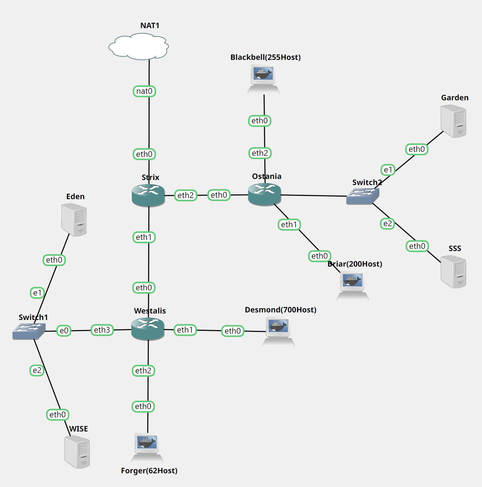
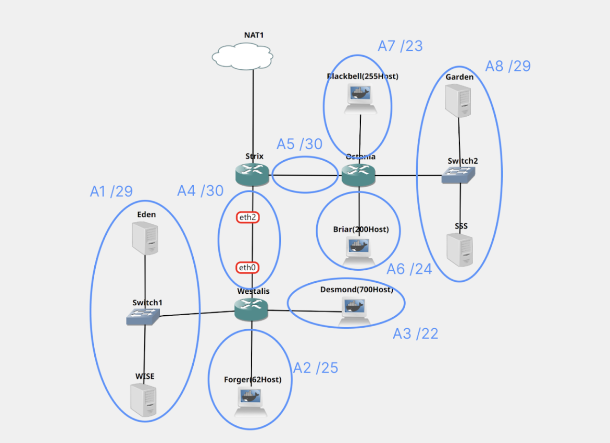
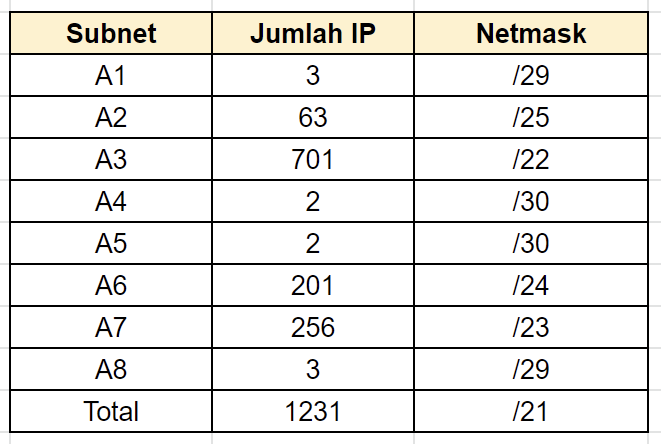
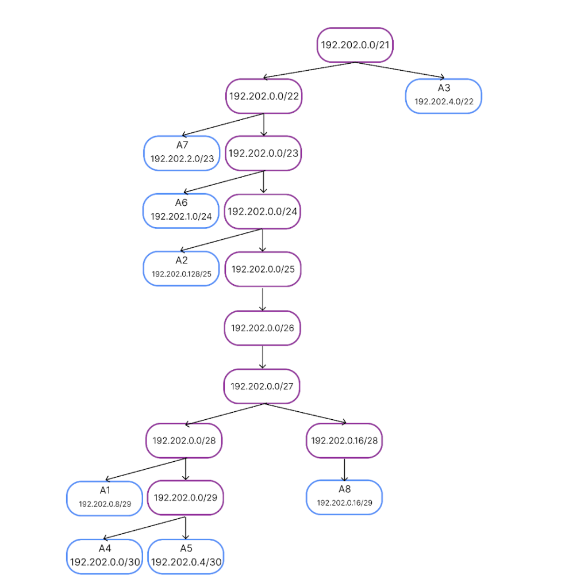
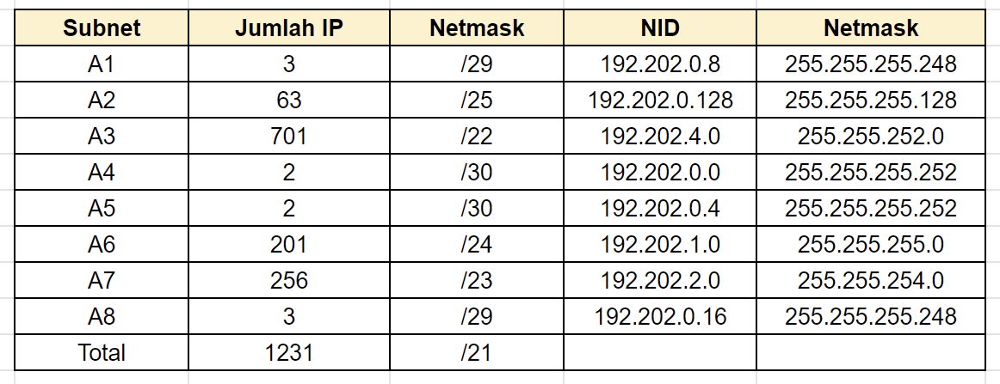

# Jarkom-Modul-5-F06-2022

## Kelompok F06

|               Nama               |      NRP      |
| -------------------------------- | ------------- |
| Benedictus Bimo Cahyo Wicaksono  |  5025201097   |  
| Andhika Ditya Bagaskara D.       |  5025201096   |
| Theresia Nawangsih               |  5025201144   |

# (A) Topologi Soal
<p align="center">
  
</p><br>

## Keterangan :	
- Eden adalah DNS Server
- WISE adalah DHCP Server
- Garden dan SSS adalah Web Server
- Jumlah Host pada Forger adalah 62 host
- Jumlah Host pada Desmond adalah 700 host
- Jumlah Host pada Blackbell adalah 255 host
- Jumlah Host pada Briar adalah 200 host

# (B) Teknik VLSM
Pada modul 5 ini, kami menggunakan perhitungan dengan metode VLSM

## Subnetting 
<p align="center">
  
</p><br>

### Pada pembagian ini, terdapat 8 subnet dimulai dari A1-A8. Selanjutnya, kita dapat menentukan jumlah IP yang dibutuhkan pada setiap subnet.
<p align="center">
  
</p><br>

### Selanjutnya, menghitung pembagian IP dengan membuat tree.
<p align="center">
  
</p><br>

### Hasil pembagian IP
<p align="center">
  
</p><br>

## Konfigurasi
- Strix 
```
auto eth0
iface eth0 inet static
        address 192.168.122.2
        netmask 255.255.255.252
        gateway 192.168.122.1

auto eth1
iface eth1 inet static
	address 192.202.0.1
	netmask 255.255.255.252

auto eth2
iface eth2 inet static
	address 192.202.0.5
	netmask 255.255.255.252
```

- Westalis
```
auto eth0
iface eth0 inet static
	address 192.202.0.2
	netmask 255.255.255.252
        gateway 192.202.0.1

auto eth1
iface eth1 inet static
	address 192.202.4.1
	netmask 255.255.252.0

auto eth2
iface eth2 inet static
	address 192.202.0.129
	netmask 255.255.255.128

auto eth3
iface eth3 inet static
	address 192.202.0.9
	netmask 255.255.255.248
```

- Ostania
```
auto eth0
iface eth0 inet static
	address 192.202.0.6
	netmask 255.255.255.252
        gateway 192.202.0.5

auto eth1
iface eth1 inet static
	address 192.202.1.1
	netmask 255.255.255.0

auto eth2
iface eth2 inet static
	address 192.202.2.1
	netmask 255.255.254.0

auto eth3
iface eth3 inet static
	address 192.202.0.17
	netmask 255.255.255.248
```
- Eden
```
auto eth0
iface eth0 inet static
	address 192.202.0.10
	netmask 255.255.255.248
	gateway 192.202.0.9
```

- Wise 
```
auto eth0
iface eth0 inet static
	address 192.202.0.11
	netmask 255.255.255.248
	gateway 192.202.0.9
```

- Garden
```
auto eth0
iface eth0 inet static
	address 192.202.0.18
	netmask 255.255.255.248
	gateway 192.202.0.17
```

- SSS
```
auto eth0
iface eth0 inet static
	address 192.202.0.19
	netmask 255.255.255.248
	gateway 192.202.0.17
```

- Blackbell, Briar, Desmon, Forger
```
auto eth0
iface eth0 inet dhcp
```

# (C) ROUTING

- Strix
```
#A1 to Westalis
route add -net 192.202.0.8 netmask 255.255.255.248 gw 191.202.0.2
#A2 to Westalis 
route add -net 192.202.0.128 netmask 255.255.255.128 gw 192.202.0.2
#A3 to Westalis
route add -net 192.202.4.0 netmask 255.255.252.0 gw 192.202.0.2
#A8 to Ostania
route add -net 192.202.0.16 netmask 255.255.255.248 gw 192.202.0.6
#A7 to Ostania
route add -net 192.202.2.0 netmask 255.255.254.0 gw 192.202.0.6
#A6 to Ostania
route add -net 192.202.1.0 netmask 255.255.255.0 gw 192.202.0.6
```

- Westalis
```
route add -net 0.0.0.0 netmask 0.0.0.0 gw 192.202.0.1
```

- Ostania
```
route add -net 0.0.0.0 netmask 0.0.0.0 gw 192.202.0.5
```
## SETTING RELAY
Pada Ostania dan Westalis akan ditambahkan konfigurasi seperti dibawah ini

```
# What servers should the DHCP relay forward requests to?
SERVERS="192.202.0.11"

# On what interfaces should the DHCP relay (dhrelay) serve DHCP requests?
INTERFACES="eth0 eth1 eth2 eth3"

# Additional options that are passed to the DHCP relay daemon?
OPTIONS=""
```

## SETTING DHCP SERVER
Pada Wise akan ditambahkan konfigurasi seperti dibawah ini
```
subnet 192.202.0.128 netmask 255.255.255.128 {
    range 192.202.0.130 192.202.0.255;
    option routers 192.202.0.129;
    option broadcast-address 192.202.0.255;
    option domain-name-servers 192.202.0.10;
    default-lease-time 360;
    max-lease-time 7200;
}

subnet 192.202.0.8 netmask 255.255.255.248 {
}

subnet 192.202.4.0 netmask 255.255.252.0 {
    range 192.202.4.2 192.202.7.255;
    option routers 192.202.4.1;
    option broadcast-address 192.202.7.255;
    option domain-name-servers 192.202.0.10;
    default-lease-time 360;
    max-lease-time 7200;
}
subnet 192.202.2.0 netmask 255.255.254.0 {
    range 192.202.2.2 192.202.3.255;
    option routers 192.202.2.1;
    option broadcast-address 192.202.3.255;
    option domain-name-servers 192.202.0.10;
    default-lease-time 360;
    max-lease-time 7200;
}
subnet 192.202.1.0 netmask 255.255.255.0 {
    range 192.202.1.2 192.202.1.255;
    option routers 192.202.1.1;
    option broadcast-address 192.202.1.255;
    option domain-name-servers 192.202.0.10;
    default-lease-time 360;
    max-lease-time 7200;
}
```


